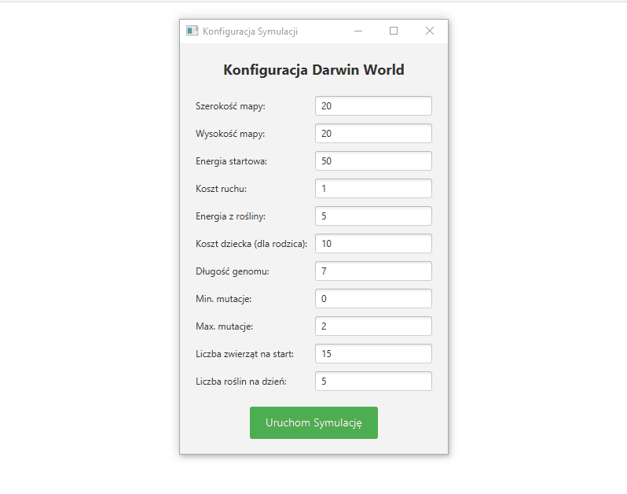

# Darwin World – Evolutionary Simulation

## O projekcie
Darwin World to interaktywna symulacja ewolucyjna napisana w języku Java z wykorzystaniem biblioteki JavaFX. Projekt pozwala obserwować procesy selekcji naturalnej, dziedziczenia genów oraz adaptacji organizmów do zmiennych warunków środowiskowych.

### Kluczowe funkcjonalności:
* **System Genotypów:** Każde zwierzę posiada unikalny kod genetyczny determinujący jego ruchy.
* **Mechanizm Rozmnażania:** Silniejsze osobniki przekazują swoje geny potomstwu, uwzględniając mutacje.
* **Dynamiczny Klimat:** System pór roku (lato/zima) wpływa na wegetację roślin oraz poziom energii zwierząt.
* **Statystyki Live:** Panel analityczny śledzący populację, średnią energię, długość życia oraz dominujące genotypy.

## Technologie
* **Język:** Java 25
* **GUI:** JavaFX (FXML)
* **Zarządzanie projektem:** Gradle
* **Architektura:** MVP 

## Konfiguracja
Aplikacja oferuje pełną kontrolę nad parametrami symulacji poprzez intuicyjny formularz startowy:
* Wymiary mapy i początkowa liczba zwierząt.
* Poziomy energii.
* Parametry genetyczne.

## Jak uruchomić?
1. Sklonuj repozytorium: `git clone https://github.com/twoj-nick/darwin-world.git`
2. Otwórz projekt w środowisku IDE (np. IntelliJ IDEA).
3. Uruchom klasę `AppLauncher` znajdującą się w pakiecie `gui`.

